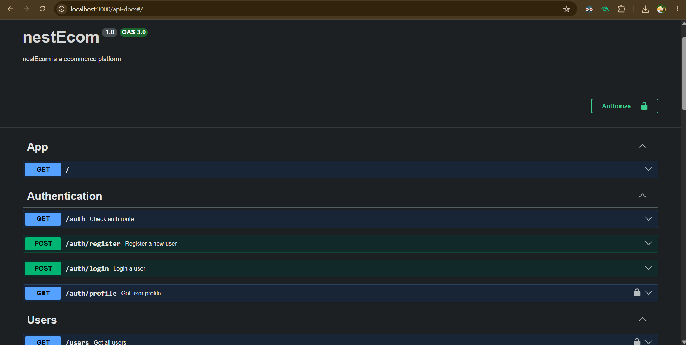
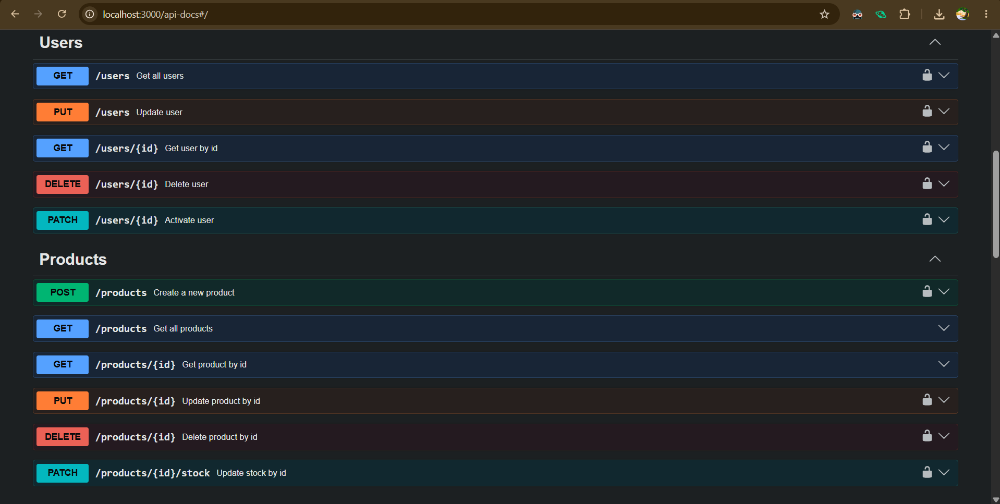
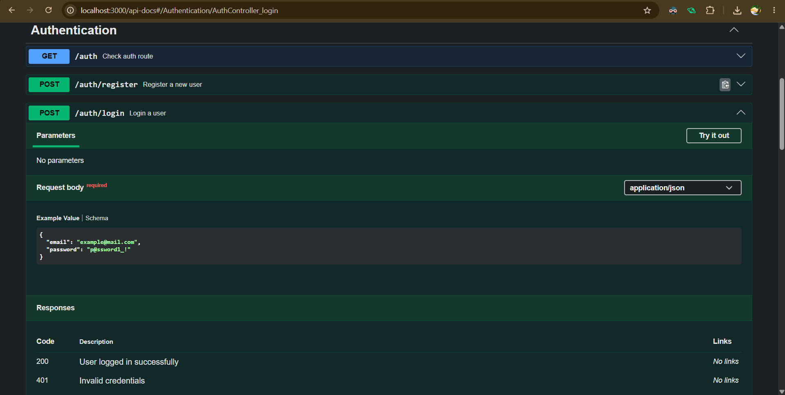
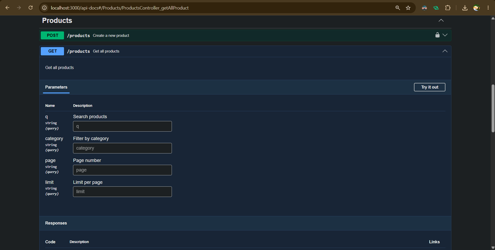
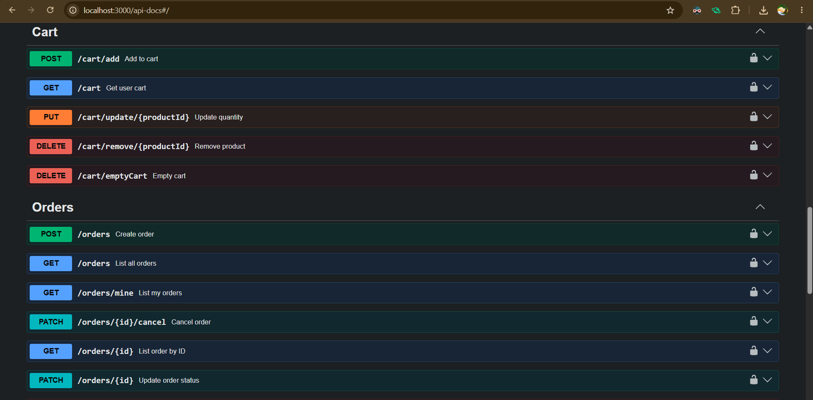
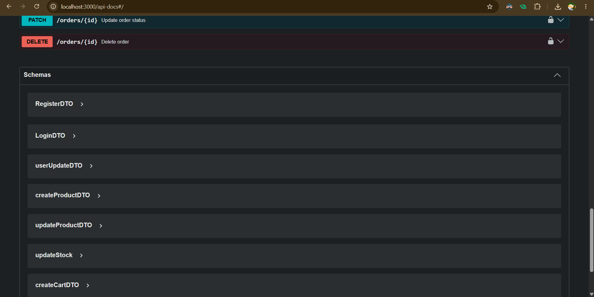

# 📦 nestEcom: Scalable E-Commerce REST API

Welcome to **nestEcom**—a robust, production-ready RESTful API designed to power modern e-commerce storefronts. Built on top of the progressive **NestJS** framework, this project uses **TypeScript**, **Mongoose** (MongoDB), and best-in-class libraries to deliver a secure, performance-optimized, and transactional backend.

Whether you're looking to run this locally, study its design patterns, or deploy it to production, this guide will walk you through everything you need to know.

---

## 🛠️ The Tech Stack

We chose a modern, developer-friendly tech stack focused on scalability, developer velocity, and runtime reliability:

*   **Runtime Framework:** [NestJS (v11)](https://nestjs.com/) — Structured, enterprise-ready Node.js architecture.
*   **Database ODM:** [Mongoose](https://mongoosejs.com/) with MongoDB — Schema definition and modeling.
*   **API Documentation:** [Swagger UI](https://swagger.io/) — Self-documenting, interactive endpoints.
*   **Security:** [Helmet](https://helmetjs.github.io/) (HTTP security headers) & [@nestjs/throttler](https://github.com/nestjs/throttler) (rate-limiting).
*   **Logging:** [Winston Log](https://github.com/winstonjs/winston) — Custom structured logging to console & file.
*   **Validation:** [class-validator](https://github.com/typestack/class-validator) & [class-transformer](https://github.com/typestack/class-transformer) — Automated request payload parsing.
*   **Authentication:** [JWT](https://jwt.io/) & [bcrypt](https://github.com/kelektiv/node.bcrypt.js) — Secure password hashing and token-based sessions.

---

## 🚀 Key Features

### 1. Robust Auth & Role-Based Access Control (RBAC)
*   **Rate-Limited Logins:** To protect against brute-force attacks, the login endpoint restricts authentication requests via a custom throttler guard (configured to allow a maximum of 3 login attempts per minute).
*   **Role Management:** Users are assigned roles (e.g., `user` or `admin`). Admin-only routes are protected by a custom, declarative `@Roles(['admin'])` decorator combined with a global `RolesGuard`.

### 2. Full-Lifecycle Shopping Cart & Product Catalog
*   **Dynamic Cart Operations:** Logged-in users can fetch their cart, add products, adjust item quantities, remove specific items, or empty their entire cart in a single request.
*   **Search & Pagination:** The product retrieval endpoints support query search filters (`q`), category filters, and cursor-like page and limit query variables, keeping database queries performant as your inventory grows.

### 3. Transactional Checkout & Order Safety
*   **MongoDB/Mongoose Sessions:** Placing an order is an atomic operation. The checkout routine initiates a database transaction to:
    1.  Validate inventory levels.
    2.  Deduct product stock.
    3.  Create the order document.
    4.  Clear the user's shopping cart.
    *If any step fails, the entire transaction is rolled back instantly.*
*   **Cancellation Safety:** Cancelling a pending order automatically restores the respective product stock levels using database transaction guarantees.

### 4. Consistent API Formats
*   **Success Interceptor:** Every successful response is automatically formatted by a global `TransformInterceptor` into a clean, predictable envelope:
    ```json
    {
      "success": true,
      "result": { ... }
    }
    ```
*   **Standardized Error Handling:** The global `HttpExceptionFilter` intercepts exceptions and formats them, preventing stack trace leaks:
    ```json
    {
      "success": false,
      "error": {
        "statusCode": 400,
        "path": "/products",
        "error": "Bad Request",
        "message": "Name cannot exceed 100 characters",
        "timestamp": "2026-06-26T14:30:00.000Z"
      }
    }
    ```

---

---

## ⚙️ Local Development Setup

Follow these steps to run `nestEcom` on your local environment:

### Prerequisites
*   [Node.js](https://nodejs.org/) (v18 or higher recommended)
*   [MongoDB](https://www.mongodb.com/) (running locally or in the cloud)

### 1. Install Dependencies
Clone the repository and install the dependencies:
```bash
npm install
```

### 2. Configure Environment Variables
Create a `.env` file in the root directory and define the following variables:
```env
# MongoDB Connection String
CONN_STRING=mongodb://localhost:27017/nestEcom

# JWT Secret Key for token signing and validation
JWT_SECRET=myJWTkeyIs_verySecret@1990
```

> [!NOTE]
> If you are running MongoDB inside Docker, you may want to append the replica set configurations:
> `CONN_STRING=mongodb://localhost:27017/nestEcom?replicaSet=rs0&retryWrites=true&w=majority`

### 3. Run the Server
Use one of the following npm scripts:

```bash
# Development (with file watching)
npm run start:dev

# Production build and run
npm run build
npm run start:prod

# Debug mode
npm run start:debug
```

Once started, the server will default to listening on port `3000` (unless configured otherwise in your environment settings).

---

## 📖 API Documentation & Testing

`nestEcom` comes with pre-configured Swagger API documentation. 

With the application running, navigate to:
🔗 **[http://localhost:3000/api-docs](http://localhost:3000/api-docs)**

From there, you can interactively test all endpoints. 

### Quick Authentication Walkthrough:
1.  **Register a User**: Make a POST request to `/auth/register`. Remember to set the `role` field to `admin` if you want to test restricted routes.
2.  **Login**: Make a POST request to `/auth/login` to obtain your access token.
3.  **Authorize**: Click the **Authorize** button in Swagger (top right) and paste the token. All future requests made within Swagger will automatically append the `Authorization: Bearer <token>` header.

### 📸 Swagger UI Screenshots

Below is a visual overview of the interactive Swagger endpoints and data schemas available at the documentation endpoint:

| Authentication & Security | Products & Catalog |
| --- | --- |
| **Authentication Endpoints**<br> | **Products & Catalog Endpoints**<br> |
| **Secure Login Interface**<br> | **Product Retrieval with Pagination & Search**<br> |

| Shopping Cart & Checkout | Data Schemas |
| --- | --- |
| **Cart & Order Actions**<br> | **API Response and Request Data Schemas**<br> |

---

## 🧪 Testing

Jest is pre-configured for both unit testing and end-to-end (e2e) tests:

```bash
# Run unit tests
npm run test

# Watch mode for active development
npm run test:watch

# Run end-to-end tests
npm run test:e2e

# Generate test coverage reports
npm run test:cov
```

---

## 📝 Logs

Structured logs are written by Winston to the standard output as well as physical log files on disk (created in the `logs/` directory):
*   `logs/combine.log`: Contains all application events.
*   `logs/error.log`: Contains application errors only, stored in JSON format for parsing.

---

## 📄 License
This project is open-source and licensed under the [MIT License](https://opensource.org/licenses/MIT).
